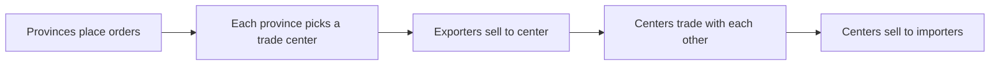

# Neovis_Trade_Illustration
An explanation of my Grand Strategy Game's trade system

A hub-based trade system for a province-level grand strategy game I've been building using Unity and C#. Every province finds its local trade center using a price equation, with both distances and taxes being accounted for, and then sell to and buy from that trade center. Trade centers balance demand among themselves, selling their excess and buying what their client provinces demanded, with distance and taxes still being considered. This system allows for players to levy taxes on their provinces or on strategic choke points, and smart path recalculation will allow for the provinces to recalculate their most strategic move, making some taxes just too high to put up with, thus forcing a balance on taxes to the player.


## Resources and regional imbalance

Each province is assigned a primary resource (and sometimes a secondary one) that it can produce, such as iron, timber, food, or silk. A province only produces that resource if it has the matching extraction building (a Mine, Lumber Camp, or Farm, for example), and output scales with the building's level. Every province also consumes goods: food for its population, upkeep for its buildings, luxury goods for its nobles and merchants, and materials for construction.

Because the map assigns resources unevenly, some provinces produce far more of a good than they use, while others produce none of what they need. Each month, a province's production minus its consumption becomes either an export order (surplus) or an import order (shortfall). Those orders are the demand and supply that the trade system balances.


## **Trade center map**


_This is the overall trade center map. Where all resources are bought from or sold to_


_Here I have a province selected to show the provinces it buys and sells from. As you can tell, this province is a trade center._


## How a tick works



1. `ProvincialEconomy` places import and export orders.
2. Each province picks one trade center for all its goods.
3. Exporters sell their surplus to that center.
4. Centers with a deficit bid on centers with an excess.
5. Centers sell what they hold to their importers.

Distance costs and passage taxes are charged on every leg.

## Choosing a trade center

Each province scores every reachable center within range and picks the highest. Score is net profit across all the province's orders:

```csharp
foreach (TradeGood exportOrder in exportOrders)
    score += (price - distTTC) * exportOrder.amount;   // earnings if we sell here

foreach (TradeGood importOrder in importOrders)
    score -= (price + distTTC) * importOrder.amount;   // cost if we buy here
```

`distTTC` is the path's total cost, movement plus passage taxes, so a heavily taxed route lowers a center's score.

## Pathfinding and taxes

`SmartTradePath` runs Dijkstra over land and ocean provinces. Edge cost is a base land or ocean cost plus the province's passage tax. Paths are cached, and changing a tax or ban invalidates the affected paths so they recompute on the next fetch.

Land taxes go to the province owner. Ocean taxes are split between every nation with a stake, weighted by `tax × control`. Control comes from bordering land provinces and trade ships.


## Balancing between centers

A center's balance for a good is its stored stock minus the import orders routed to it. A negative balance is a deficit. Deficit centers bid on centers with an excess, offering their own price minus the transit cost:

```csharp
Bid newBid = new Bid
{
    price  = tradeCenterProvince.tradeCenterData.tradeCenterPricing[i] - transitCost,
    path   = CombineRoute(tradeCenterResult.route),
    amount = Mathf.Min(Mathf.Abs(excessesAndDeficits[i]), Mathf.Abs(otherDeficits[i])),
    ...
};
```

Each center with an excess then accepts the highest bids first until its excess or the bids run out.

## Files

| File | Role |
|---|---|
| `TradeSystem.cs` | Tick pipeline, center selection, bidding, settlement |
| `ProvincialEconomy.cs` | Production, consumption, and order generation |
| `SmartTradePath.cs` | Pathfinding, path cache, bans and taxes |
| `SmartTradeUI.cs` | Passage ban and tax UI |

## Status

Price adjustment at trade centers is implemented but currently disabled, so prices stay at their starting value.

